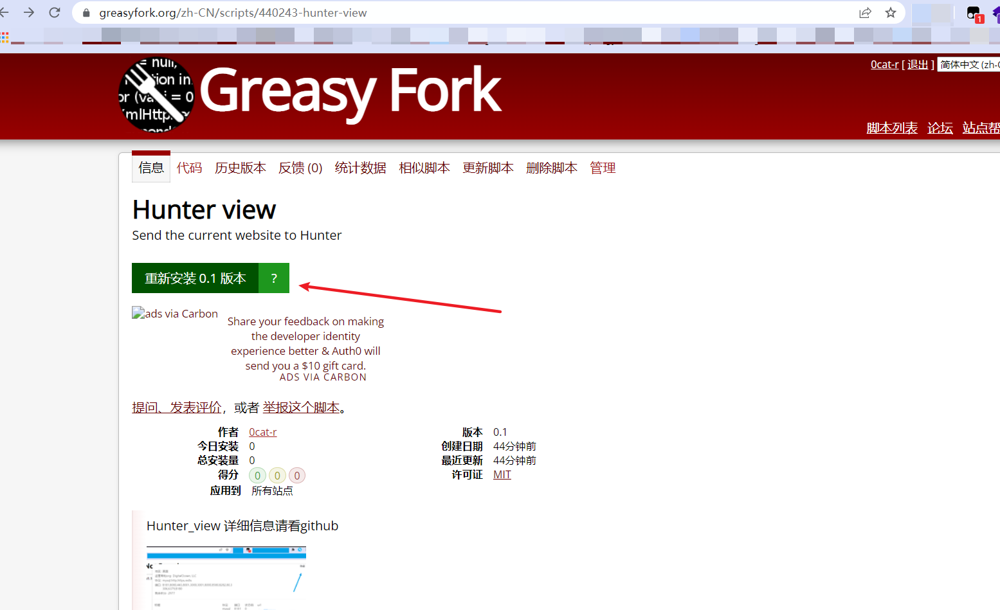
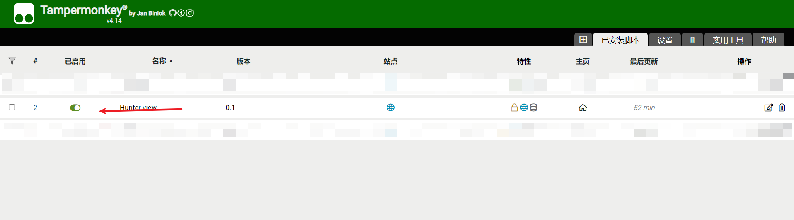
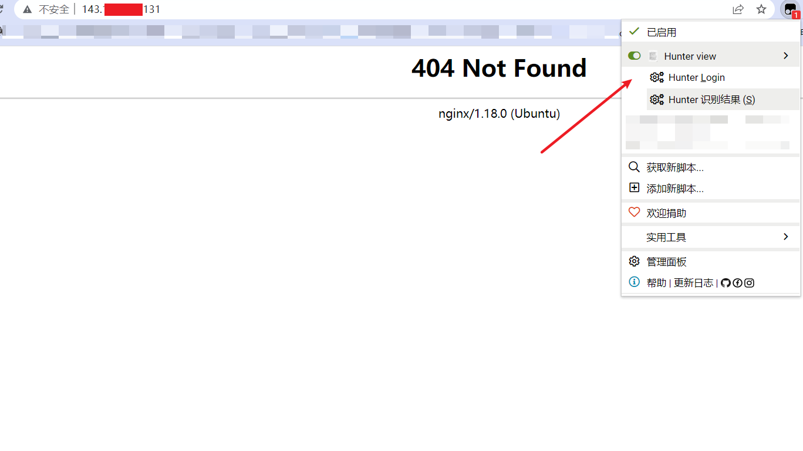
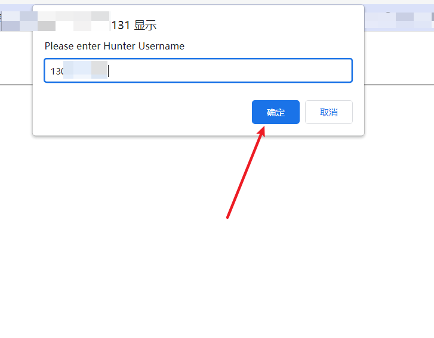
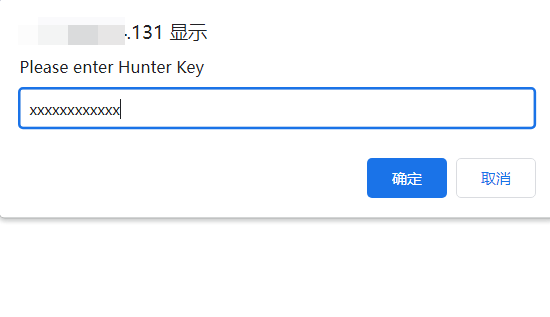
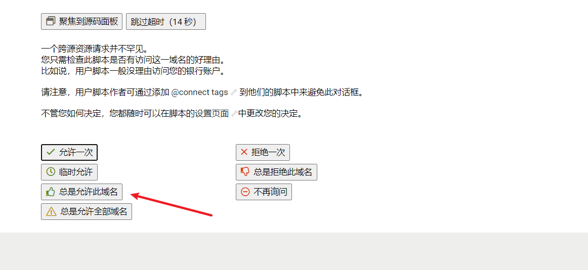
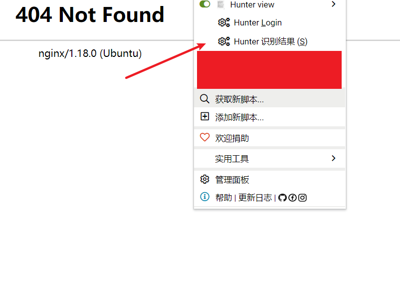
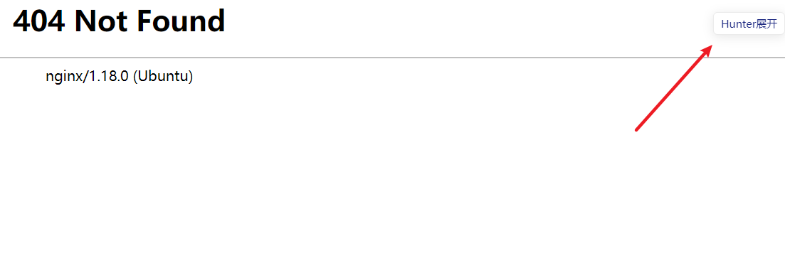
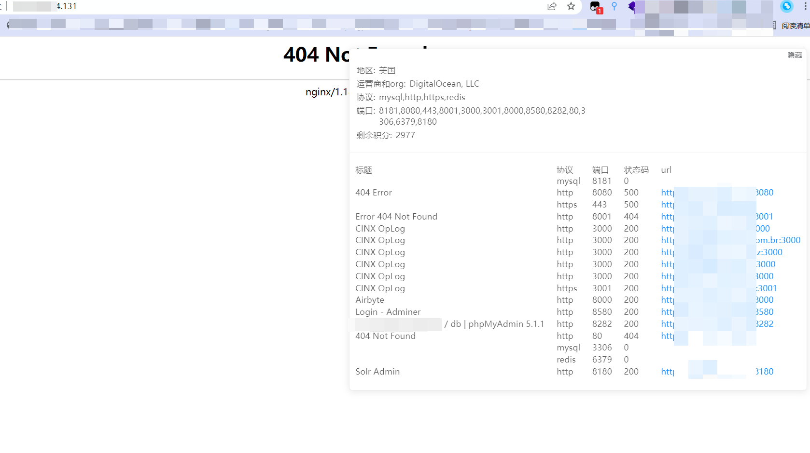
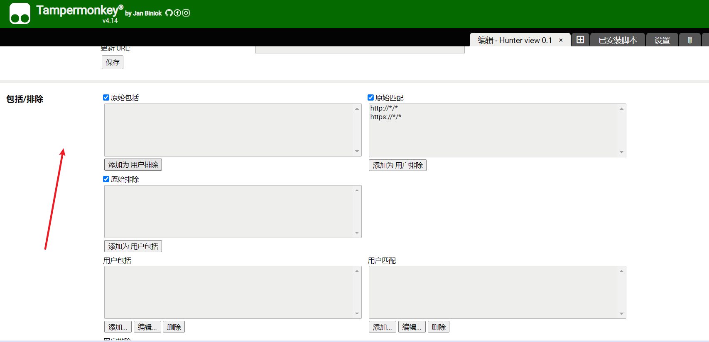

# Hunter_view

郑重声明：文中所涉及的技术、思路和工具仅供以安全为目的的学习交流使用，任何人不得将其用于非法用途以及盈利等目的，否则后果自行承担。

感谢[lhc0229](https://github.com/lhc0229)、[倾旋](https://github.com/Rvn0xsy)和[alex9968](https://github.com/alex9968)的答疑解惑，以及lhc0229对这个项目前端的支持。

[中文简体](./README_zh.md)

| 类别 | 说明 |
| ---- | --- |
| 作者 | [0cat](https://github.com/0cat-r) | 
| 团队 | [0x727](https://github.com/0x727) 未来一段时间将陆续开源工具 |
| 定位 | 直观了解网站资产(通过Hunter),自动化,交互方便，美观|
| 语言 | js.... |
| 功能 | 直观展示网站资产,资产有及时性,浮窗化交互，可自动跳转.... | 

## 什么是 【Hunter view】 ?

Hunter view 是一款Hunter(鹰图平台)资产展示的浏览器油猴插件脚本。

## Why 【Hunter view】 ?

Hunter的资产个人认为各方面是都很好,甚至某些程度上超越了FOFA,(当然FOFA的油猴脚本也在开发中了...),通过这个油猴插件可以快速直观的了解网站的资产情况。

资产的准确度：采用“==”精准匹配

资产的时效性：总是搜索当前站点在Hunter平台上距离当前时间前6个月的资产情况(本来是三个月 但是为了数据的隐藏价值 所以改成6个月)，以及包括对闰年，某些月份是30天的判断

资产的直观性：title port 等等 包括去重

交互的友好型：想看的时候点击右上角就出现小模块，点击就展开显示数据详情，不看的时候就收回

url处可以点击直接新建标签页跳转。

安装的快捷：本项目已经公开分享到greasyfork,安装完油猴插件之后，直接搜索即可安装。
          可自动推送更新。

## 快速开始体验

### 1. 安装油猴

首先浏览器需要安装油猴插件，下面链接写的而很详细。
https://zhuanlan.zhihu.com/p/128453110

### 2. 获取脚本并安装
方式一：可直接浏览器搜索然后点击安装即可
https://greasyfork.org/zh-CN/scripts/440243-hunter-view

方式二：你也可以在greasyfork搜索Hunter view, (如果搜索不到，点击显示所有语言的结果)
然后直接安装

安装完成之后记得在管理面板给它启用

## 使用方法

1. 登录

# !!!第一次用hunter api的同学 记得先重置（刷新）下自己的key 再去登录

（很多朋友反映第一次使用key的话查不出数据，重置下key就好了  平台的问题）
打开任意一个网站，点击登录

输入Hunter平台的手机号和key值

key值在hunter平台的个人中心有展示。

登录一次之后即可 其他网站不需要重复登录。

2. 使用演示

第一次使用需要给权限，这里选总是允许。

然后刷新网站，加载脚本

之后点击 Hunter 识别结果

这个时候网站右上角会出现小按钮

点开按钮 展示数据

展示界面的url 可以直接点击会新建标签页跳转到指定链接。
并且返回来的时候 标签不会收缩，方便继续阅读，想收缩的时候，点击收缩即可。

## 注意事项
默认收集的是前六个月的20条资产，（考虑到单个网站的资产量不大）
每次使用消耗个位数的积分，当然有黑名单机制，你可以点击这里 这样就不会去查询这个网站，建议添加*.baidu.com 等等

## 为 【Hunter view】 做贡献

【Hunter view】 是一个免费且开源的项目，我们欢迎任何人为其开发和进步贡献力量。

- 在使用过程中出现任何问题，可以通过 issues 来反馈。
- Bug 的修复可以直接提交 Pull Request 到 dev 分支。
- 如果是增加新的功能特性，请先创建一个 issue 并做简单描述以及大致的实现方法，提议被采纳后，就可以创建一个实现新特性的 Pull Request。
- 欢迎对说明文档做出改善，帮助更多的人使用 【Hunter view】
- 贡献代码请提交 PR 至 dev 分支，master 分支仅用于发布稳定可用版本。
- 如果你有任何其他方面的问题或合作，欢迎发送邮件至 0x727Team@gmail.com或者2034009618@qq.com本人邮箱。

> 提醒：和项目相关的问题最好在 issues 中反馈，这样方便其他有类似问题的人可以快速查找解决方法，并且也避免了我们重复回答一些问题。
